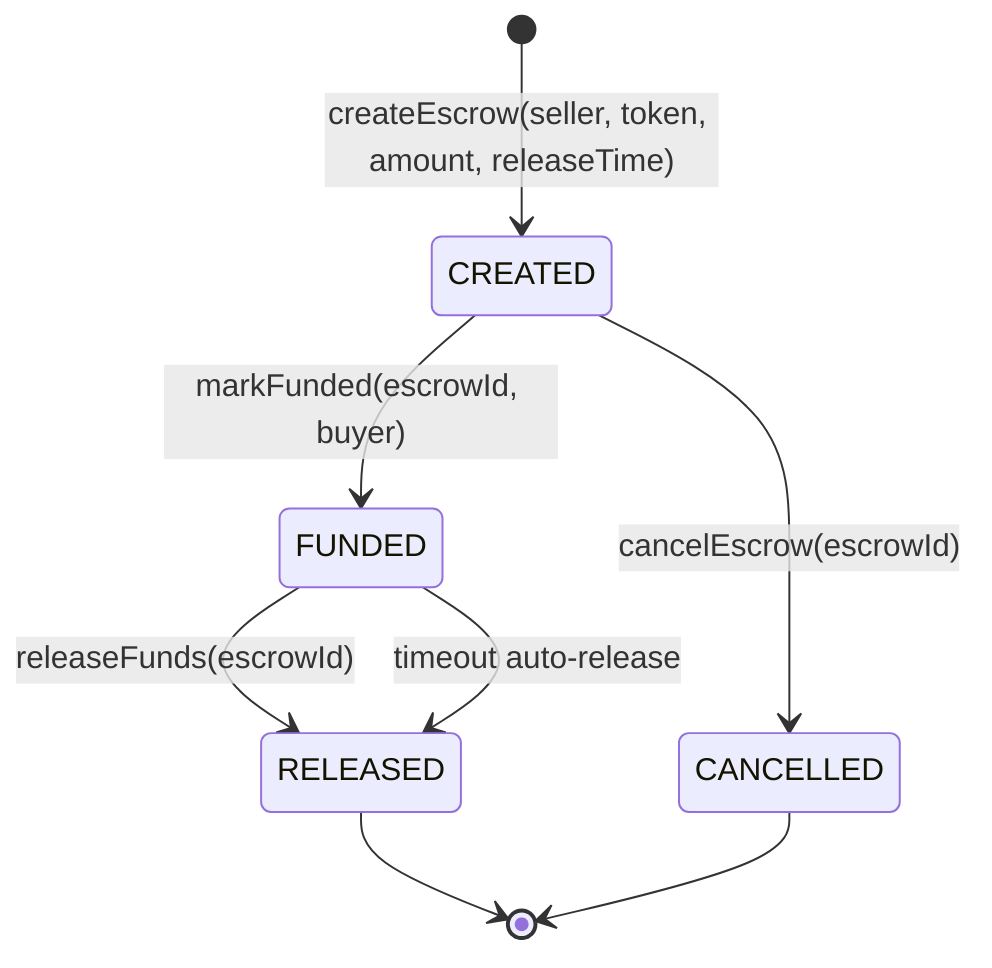
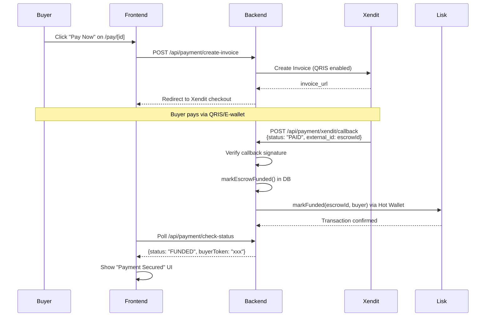
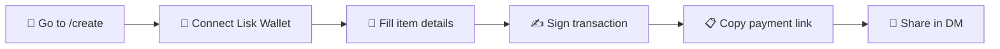
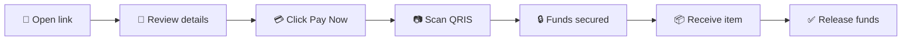
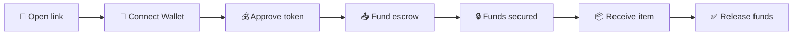
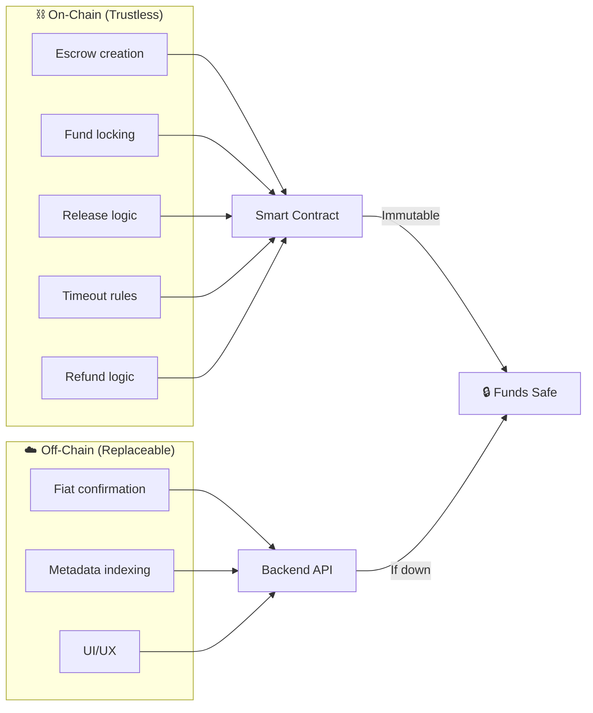

# Vouch - Decentralized Escrow for Social Commerce

> **Marketplace-level trust — without the marketplace.**

Built on **Lisk** | For **Instagram • WhatsApp • TikTok**


---

## 📖 Table of Contents

1. [What is Vouch?](#-what-is-vouch)
2. [The Problem](#-the-problem)
3. [Architecture](#%EF%B8%8F-architecture-overview)
4. [Smart Contracts](#-smart-contracts)
5. [Xendit Payment Flow](#-xendit-payment-flow-fiat-bridge)
6. [User Flows](#-user-flows)
7. [Project Structure](#-project-structure)
8. [Quick Start](#-quick-start)
9. [Contract Deployment](#-contract-deployment)
10. [Tech Stack](#-tech-stack)
11. [Security Model](#%EF%B8%8F-security-model)

---

## 🎯 What is Vouch?

Vouch is a **hybrid decentralized escrow platform** that adds a trust layer to social commerce transactions happening in DMs (Instagram, WhatsApp, TikTok).

### How It Works
1. **Seller** connects their Lisk wallet and creates a secure payment link
2. **Buyer** pays via familiar methods (QRIS, bank transfer) — no wallet needed
3. **Smart Contract** holds funds until buyer confirms delivery
4. **Funds released** automatically to seller's wallet

**No login. No registration. No marketplace fees.**

---

## 😰 The Problem

Social commerce happens in DMs. **But trust doesn't.**

| Issue | Impact |
|-------|--------|
| Buyers afraid to pay first | Lost sales |
| Sellers afraid to ship first | No trust |
| No escrow in Instagram/WhatsApp | Scams |
| Marketplaces force fees | 10-20% cut |

**Vouch solves this** by providing escrow-as-a-service that lives *in the chat*, not on another platform.

---

## 🏗️ Architecture Overview

```mermaid
graph TB
    subgraph Frontend["🖥️ Frontend (Next.js 15)"]
        Create["/create<br/>Seller creates link"]
        Pay["/pay/[id]<br/>Buyer pays"]
        Dashboard["/dashboard<br/>Seller views escrows"]
        Demo["/demo/*<br/>Chat simulations"]
        Deck["/deck<br/>Pitch deck"]
    end

    subgraph Backend["⚙️ Backend API (Express.js)"]
        EscrowAPI["Escrow Routes<br/>/api/escrow/*"]
        PaymentAPI["Payment Routes<br/>/api/payment/*"]
        FaucetAPI["Faucet Routes<br/>/api/faucet/*"]
        DB[(SQLite + Prisma)]
        HotWallet["🔐 Protocol Hot Wallet"]
    end

    subgraph Blockchain["⛓️ Lisk Sepolia"]
        VouchEscrow["VouchEscrow.sol<br/>Main escrow logic"]
        MockUSDC["MockUSDC.sol<br/>Test stablecoin"]
        MockIDRX["MockIDRX.sol<br/>IDR stablecoin"]
    end

    subgraph External["🌐 External Services"]
        Xendit["Xendit API<br/>QRIS, VA, E-wallets"]
    end

    Create -->|1. Connect wallet| EscrowAPI
    EscrowAPI -->|2. createEscrow()| VouchEscrow
    VouchEscrow -->|3. Return escrowId| EscrowAPI
    EscrowAPI -->|4. Store in DB| DB

    Pay -->|5. Initiate payment| PaymentAPI
    PaymentAPI -->|6. Create invoice| Xendit
    Xendit -->|7. Buyer pays QRIS| PaymentAPI
    PaymentAPI -->|8. markFunded()| HotWallet
    HotWallet -->|9. On-chain tx| VouchEscrow

    Dashboard -->|10. View status| EscrowAPI
    EscrowAPI -->|11. Read escrow| VouchEscrow
```

---

## 📜 Smart Contracts

### Deployed Addresses (Lisk Sepolia)

| Contract | Address | Description |
|----------|---------|-------------|
| **VouchEscrow** | `0xb015d8Eb15B5E82E10aCF1606c60cFD64C4c7cB2` | Main escrow logic |
| **MockUSDC** | `0xB7c78ceCB25a1c40b3fa3382bAf3F34c9b5bdD66` | Test USDC token |
| **MockIDRX** | `0xDfef62cf7516508B865440E5819e5435e69adceb` | Test IDRX token |

### Lisk Sepolia Network Details

| Property | Value |
|----------|-------|
| Chain ID | `4202` |
| RPC URL | `https://rpc.sepolia-api.lisk.com` |
| Block Explorer | `https://sepolia-blockscout.lisk.com` |
| Faucet | `https://sepolia-faucet.lisk.com` |

### VouchEscrow.sol — State Machine



### Contract Functions

| Function | Access | Description |
|----------|--------|-------------|
| `createEscrow(token, amount, releaseTime)` | Seller | Create new escrow, returns `escrowId` |
| `markFunded(escrowId, buyer)` | Protocol/Buyer | Lock funds after payment |
| `fundEscrow(escrowId)` | Buyer (Crypto) | Direct crypto funding |
| `releaseFunds(escrowId)` | Buyer | Release funds to seller |
| `cancelEscrow(escrowId)` | Seller | Refund to buyer |
| `getEscrow(escrowId)` | Anyone | View escrow state |
| `getEscrowStatus(escrowId)` | Anyone | Get status string |

### Escrow Data Structure

```solidity
struct Escrow {
    address seller;      // Receives funds on release
    address buyer;       // Confirms delivery
    address token;       // ERC20 token (USDC/IDRX)
    uint256 amount;      // Escrow amount
    uint256 releaseTime; // Auto-release timestamp
    bool funded;         // Payment received
    bool released;       // Funds sent to seller
    bool cancelled;      // Refunded to buyer
}
```

---

## 💳 Xendit Payment Flow (Fiat Bridge)

Xendit enables buyers to pay with **local Indonesian payment methods** (QRIS, OVO, DANA, GoPay, Bank Transfer) while the escrow logic remains on-chain.

### Fiat Payment Sequence



### Xendit Integration Details

**Supported Payment Methods:**
- QRIS (universal Indonesian QR)
- OVO, DANA, LinkAja, GoPay
- Bank Transfer (BCA, BNI, BRI, Mandiri)

**Mock Mode:**
When `XENDIT_SECRET_KEY` is not set, Xendit runs in mock mode for demo purposes. Use `POST /api/payment/simulate/:id` to simulate successful payment.

### API Endpoints

| Endpoint | Method | Description |
|----------|--------|-------------|
| `/api/payment/xendit/callback` | POST | Xendit webhook receiver |
| `/api/payment/check-status` | POST | Manual status check fallback |
| `/api/payment/simulate/:id` | POST | Simulate payment (mock mode) |

### Callback Verification

```typescript
// Xendit sends x-callback-token header
const callbackToken = req.headers['x-callback-token'];
const isValid = callbackToken === process.env.XENDIT_CALLBACK_TOKEN;
```

---

## 👥 User Flows

### Seller Flow



**Steps:**
1. Visit `/create`
2. Connect MetaMask (Lisk Sepolia)
3. Enter: Product name, Price (IDR), Protection period
4. Sign `createEscrow()` transaction
5. Copy shareable link
6. Share with buyer via Instagram/WhatsApp

### Buyer Flow (Fiat)



**Steps:**
1. Open payment link from seller
2. Review item and amount
3. Click "Pay Now" → Redirected to Xendit
4. Pay via QRIS or preferred method
5. Page updates: "Funds Secured in Escrow"
6. Receive item from seller
7. Click "Release Funds" to complete

### Buyer Flow (Crypto)



---

## 📁 Project Structure

```
vouch/
├── app/                          # Next.js App Router
│   ├── page.tsx                  # Landing page
│   ├── create/page.tsx           # Seller escrow creation
│   ├── pay/[id]/page.tsx         # Buyer payment page
│   ├── dashboard/page.tsx        # Seller escrow dashboard
│   ├── deck/page.tsx             # 15-slide pitch deck
│   ├── demo/
│   │   ├── seller/page.tsx       # Chat simulation (seller POV)
│   │   ├── buyer/page.tsx        # Chat simulation (buyer POV)
│   │   └── thumbnail/page.tsx    # YouTube thumbnail generator
│   └── faucet/page.tsx           # Testnet token faucet
│
├── components/
│   ├── Hero.tsx                  # Landing page hero section
│   ├── Header.tsx                # Navigation header
│   ├── demo/DemoChatPhone.tsx    # Reusable phone mockup
│   └── ...                       # Other UI components
│
├── lib/
│   ├── wagmi.ts                  # Wallet configuration (Lisk Sepolia)
│   ├── contracts.ts              # Contract addresses & ABIs
│   └── api.ts                    # Backend API client
│
├── contracts/                    # Foundry smart contracts
│   ├── src/
│   │   ├── VouchEscrow.sol       # Main escrow contract
│   │   └── MockUSDC.sol          # Test ERC20 token
│   ├── script/
│   │   └── Deploy.s.sol          # Deployment script
│   ├── foundry.toml              # Foundry config
│   └── .gitignore                # Ignore build artifacts
│
├── server/                       # Express.js backend
│   ├── prisma/
│   │   └── schema.prisma         # Database schema
│   └── src/
│       ├── index.ts              # Server entry point
│       ├── lib/
│       │   ├── db.ts             # Database operations
│       │   ├── wallet.ts         # Hot wallet management
│       │   └── xendit.ts         # Xendit payment client
│       └── routes/
│           ├── escrow.ts         # Escrow CRUD endpoints
│           ├── payment.ts        # Payment/webhook endpoints
│           └── faucet.ts         # Testnet faucet endpoint
│
└── public/
    ├── logo.png                  # Vouch logo
    ├── lisk.png                  # Lisk logo
    └── grid.svg                  # Background pattern
```

---

## 🚀 Quick Start

### Prerequisites

- Node.js 18+
- npm or pnpm
- MetaMask browser extension
- Foundry (optional, for contract development)

### 1. Clone & Install

```bash
git clone https://github.com/your-repo/vouch.git
cd vouch

# Frontend dependencies
npm install

# Backend dependencies
cd server && npm install && npx prisma generate && cd ..

# Smart contracts (optional)
cd contracts && forge install && cd ..
```

### 2. Environment Setup

```bash
# Frontend
cp .env.local.example .env.local
# Edit: NEXT_PUBLIC_API_URL=http://localhost:3001

# Backend
cp server/.env.example server/.env
# Edit with your keys:
#   PRIVATE_KEY=0x...
#   XENDIT_SECRET_KEY=xnd_...
#   XENDIT_CALLBACK_TOKEN=...
```

### 3. Run Development Servers

```bash
# Terminal 1: Backend (port 3001)
cd server && npm run dev

# Terminal 2: Frontend (port 3000)
npm run dev
```

### 4. Open Application

- **Landing Page**: http://localhost:3000
- **Create Escrow**: http://localhost:3000/create
- **Demo Seller**: http://localhost:3000/demo/seller
- **Demo Buyer**: http://localhost:3000/demo/buyer
- **Pitch Deck**: http://localhost:3000/deck

---

## 🔧 Contract Deployment

### Deploy to Lisk Sepolia

```bash
cd contracts

# Setup environment
cp .env.example .env
# Add PRIVATE_KEY to .env

# Fund wallet
# Visit: https://sepolia-faucet.lisk.com

# Deploy
forge script script/Deploy.s.sol:DeployVouch \
  --rpc-url https://rpc.sepolia-api.lisk.com \
  --broadcast -vvv

# Verify on block explorer (optional)
forge verify-contract <ADDRESS> VouchEscrow \
  --chain-id 4202 \
  --verifier blockscout \
  --verifier-url https://sepolia-blockscout.lisk.com/api
```

### Update Frontend Config

After deployment, update `lib/contracts.ts`:

```typescript
export const VOUCH_ESCROW_ADDRESS = "0x...";
export const MOCK_USDC_ADDRESS = "0x...";
```

---

## ☁️ Vercel Deployment

### Frontend Deployment

The Next.js frontend can be deployed directly to Vercel.

**Important Notes:**
- The `server` folder is **excluded** from the Next.js build (separate backend)
- wagmi optional dependencies are handled via webpack aliases

### Environment Variables (Vercel Dashboard)

| Variable | Value |
|----------|-------|
| `NEXT_PUBLIC_API_URL` | Your backend URL (e.g., Railway, Render) |

### Backend Deployment (Separate)

The Express.js backend should be deployed separately to:
- **Railway** (recommended)
- **Render**
- **Fly.io**
- **Any Node.js host**

Backend environment variables:
```
PRIVATE_KEY=0x...
XENDIT_SECRET_KEY=xnd_...
XENDIT_CALLBACK_TOKEN=...
DATABASE_URL=file:./dev.db
```

### Build Command

```bash
npm run build
```
---

## 📦 Tech Stack

| Layer | Technology | Version |
|-------|------------|---------|
| **Frontend** | Next.js | 15 |
| | React | 19 |
| | TailwindCSS | 3 |
| | Framer Motion | 11 |
| **Wallet** | wagmi | 2 |
| | viem | 2 |
| **Backend** | Express.js | 4 |
| | TypeScript | 5 |
| | Prisma | 5 |
| **Database** | SQLite | 3 |
| **Blockchain** | Lisk Sepolia | - |
| | Solidity | 0.8.20 |
| **Contracts** | Foundry | Latest |
| **Payments** | Xendit | v2 API |

---

## 🛡️ Security Model

### What Lives On-Chain (Immutable)



### Key Security Properties

| Property | Guarantee |
|----------|-----------|
| **Non-custodial** | Funds held in smart contract, not backend |
| **Verifiable** | All transactions visible on block explorer |
| **Timeout protection** | Auto-release after protection period |
| **Buyer token** | Unique token for release authorization |

> **If the backend disappears, funds are still safe on-chain.**

---

## 🏆 Hackathon Highlights

| Aspect | Implementation |
|--------|----------------|
| **Real Blockchain** | Lisk Sepolia escrow contracts (not mocked) |
| **Fiat On-ramp** | Xendit QRIS + E-wallet integration |
| **Zero Friction** | No wallet needed for buyers |
| **Mass Adoption Ready** | Familiar UX, no crypto jargon |
| **Judge-Friendly** | Understand in <30 seconds |

---

## 📄 Additional Resources

| Resource | URL |
|----------|-----|
| **Pitch Deck** | `/deck` (15 slides w/ navigation) |
| **Demo Seller** | `/demo/seller` (chat simulation) |
| **Demo Buyer** | `/demo/buyer` (chat simulation) |
| **Thumbnail Generator** | `/demo/thumbnail` |
| **Block Explorer** | [Lisk Sepolia Blockscout](https://sepolia-blockscout.lisk.com) |
| **Faucet** | [Lisk Sepolia Faucet](https://sepolia-faucet.lisk.com) |

---

## 📜 License

MIT

---

**Built with ❤️ for the Lisk Hackathon**

*Vouch doesn't replace marketplaces. It replaces the missing trust layer in social commerce.*
